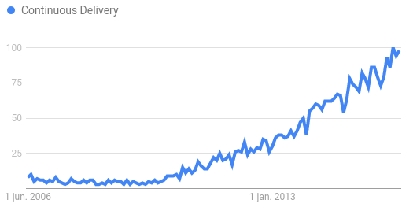
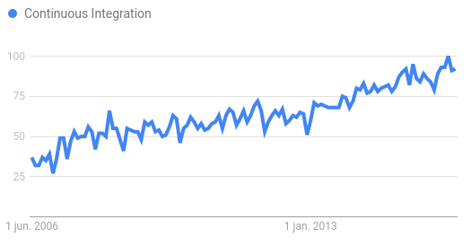

# Thesis
This repo contains the source text of my Master's thesis in Software Engineering. It is a work in progress.

Check [HISTORY.md](HISTORY.md) to see what changed. Looking for the latest pdf version? [Click here](thesis/output/thesis.pdf).

# Todo

 - [ ] Add picture of current pipeline architecture
 - [ ] Add overview of manual steps in CD process
    - How much time does it take
    - How often does it happen (once, daily, every sprint, ...)
    - What kind of faults occur, what frequency?
    - Why isn't/couldn't this step be automated
 - [ ] Indicate maintenance effort
    - What maintenance jobs are there?
    - What frequency, how much work, what goes wrong?

 - [ ] Create a structured problem description
 - [ ] Identify CI solutions and performance in practice
 - [ ] Identify improvements with thorough problem analysis
 - [ ] Realize the improvements
 - [ ] Report on the performance of the improved situation
 
# Notes
 - Tooling (maven, etc.) needs to be installed in Jenkins on initial setupp

# Popularity

[source](https://www.google.com/trends/explore?date=2006-06-01%202016-06-01&q=Continuous%20Delivery)

[source](https://www.google.com/trends/explore?date=2006-06-01%202016-06-01&q=Continuous%20Integration)

# Problems

## CD Tooling
To be able to incorporate CI and CD in the software process tooling is necessary.
If I look at the projects that we do it mainly comes down to the following setup.

  1. Gitlab
  2. Nexus
  3. Jenkins CI
  4. SonarQube
  5. Custom QA assessment tooling
  6. Selenium
  7. Custom cloud orchestration tooling
  8. Docker servers
  9. Production like environment

It is probably obvious that the setup of this combination of tools is non-trivial. To be able to make the tooling integrate seamlessly one needs to have in-depth knowledge of each of the tools.
At the development organization we long have stopped with maintaining a single setup for all teams. In the past a single setup has proven to become difficult to upgrade without hurting anyone. It was also impossible for teams to request installation of plugins or to cater for different CI scenario's. We have since chosen for team specific and on-demand service infrastructure based on Docker. This means that teams have their own cloud infrastructure for hosting the CI/CD tooling and for deploying the application(s) they develop. We can now, with a couple of button clicks, start a new team infrastructure including the CI/CD tooling.

While this is a big step forward it simply isn't enough. After provisioning, the environment still needs configuration in order to integrate the CI/CD services. Integration usually means that after a push to Gitlab, Jenkins starts to build the software. Then you should run the unit tests, publish artifacts to nexus, run SonarQube for QA and build a cloud package. After that the cloud tooling should be informed to deploy a new version of the software and start the Selenium integration tests.

It is usually the responsibility of the team to configure this correctly. It means that one or more team members should have knowledge of all systems mentioned and how to configure them. It also entails repetitive work for every artifact that should go through the pipeline. Furthermore all teams usually configure it a bit differently which leads to non-uniform environments.

 - How to solve the CI/CD pipeline configuration?
 - Usually CD is a major investment, can we reduce costs?
 - Tooling in a particular configuration set are required; this is fragile since one change might break the pipeline. Can we make the pipeline more resilient?

## CD Adoption
Deciding that you want to do CD and actually doing CD are two completely different things. Depending on the current state of the project and the level of knowledge and commitment amongst its members and stakeholders it might be very hard to incorporate CD best practices and strategies into the development process.
CD doesn't only heavily depend on tools but also on process. With the tooling in place CD can still fail. Team members should incorporate the CD philosophy into their every day activities. It demands a certain kind of work-flow and willingness of members to always produce production ready code.
It also demands that people, to some extend, give up their preferred roles. Developers are not just developers. Testers are not just testers. Sysadmins are not just sysadmins. CD requires adoption of the DevOps philosophy. Everyone will be responsible for producing production quality code. Everyone will be responsible for tests. Everyone will be responsible for deploying the application and maintaining the automation of the CI/CD pipeline. Not everyone will be willing to give up or share their role.
And then there is the business. The business might not be willing to have that many release cycles. How will they update customers? But even then, CD is valuable because it gives constant feedback about the quality of the entire system.

Even if you can work out the process and everyone is willing to contribute it might still be a hard nut to crack because of legacy systems with low test coverage. Investment is needed to crank up the test coverage before decision makers might convinced to automatically roll-out changes.

 - What are problems that teams encounter when CD is introduced?
 - What are their mitigation strategies/solutions to these problems?
 - What is the impact of CD on ...
   - Software quality
     - Are bugs found earlier (before production)
   - Development pace
 - What is the impact of CD on team roles?
 - Do the proposed benefits of CD actually exist?
   - Do the benefits outweigh the overhead of CD?

# Papers / Articles

## [Stack Overflow: CI vs CD ](http://stackoverflow.com/questions/28608015/continuous-integration-vs-continuous-delivery-vs-continuous-deployment)
 -

## http://martinfowler.com/bliki/ContinuousDelivery.html
 -

## On the journey to continuous deployment: Technical and social challenges along the way
Literature review and case study at Atlassian. Contains summary of challenges faced and mitigation strategies.

 - organisations need to be well prepared to handle technical and social adoption challenges
 - requires proper hardware and software to handle the CD process
 - software developers may feel an increased amount of pressure to have code ready to be deployed immediately
 - lack of understanding / lack of motivation
 - team members have to adapt to different tasks in new roles due to working in a CD environment
 - customers may not notice the newly added features
 - this papers mentions 'T. Fitz, Continuous Deployment at IMVU: Doing the Impossible Fifty Times a Day' as where the term CD was first used.

## Read List

 * [T. Fitz, Continuous Deployment at IMVU: Doing the Impossible Fifty Times a
Day.](http://timothyfitz.com/2009/02/10/continuous-deployment-at-imvu-doing-the-impossible-fifty-times-a-day/) **(coined term CD)**

 -  [H.H. Olsson, H. Alahyari, J. Bosch, Climbing the ‘‘Stairway to Heaven’’](http://ieeexplore.ieee.org/document/6328180/)
 - [J. Humble, D. Farley, Continuous Delivery: Reliable Software Releases through
Build, Test, and Deployment Automation](https://scholar.google.nl/scholar?hl=nl&q=Continuous+Delivery%3A+Reliable+Software+Releases+through+Build%2C+Test%2C+and+Deployment+Automation&btnG=&lr=)
 - [J. Bosch (editor), Continuous Software Engineering, book](http://link.springer.com/book/10.1007/978-3-319-11283-1)
 - [Yuhong Liu, Chengbo Li and Wei Liu, Integrated Solution for Timely Delivery of Customer Change Requests: A Case Study of Using DevOps Approach](http://www.sersc.org/journals/IJUNESST/vol7_no2/4.pdf)
 - [Mathias Meyer, Continuous Integration and Its Tools](http://ieeexplore.ieee.org/document/6802994/)

### Maybe's

 - [Eric Ries, The Lean Startup](https://www.bol.com/nl/p/the-lean-startup/1001004011646750/?Referrer=ADVNLGOO002011I-NZRCXS3C4BP4A-48184046970)
