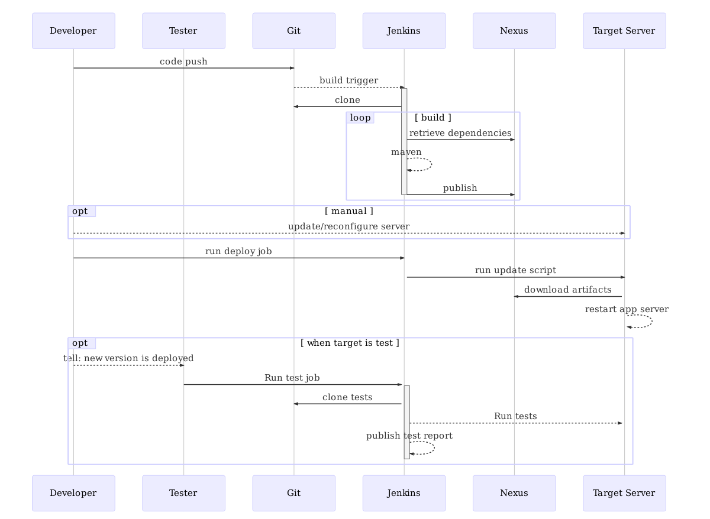

# The development organization
In order to understand the problems at the organization it is important to have
a deeper understanding of the development organization's structure.
The organization is a semi-governmental IT project organization who's mission is
to help other (semi-)governmental organizations with IT project management and
the realization of projects. They lead by example and help the customer
to shape their project according to agile principles.
In this thesis we are only concerned with the department responsible for software
project realization. Within the Software Delivery (SD) department project teams
build software in an agile way. Because some customers are still used to work
according to a waterfall approach the department plays an important role in guiding customers.
The SD project team helps the customer getting familiar with Agile/Scrum
principles in order for them to steer and make decisions about importance of tasks.
Before a project ends up at SD it usually follows a pre-development
process in which some architectural decisions are already made. This is mostly
because governments have to apply to standards and regulations.
Usually the software realization team is not involved in this process since
the team is not yet in existence. This procedure as described here may vary
per project and customer, but it usually applies. When the realization team is
formed most of the fundamental decisions have already been taken.

To be able to quickly react to customer needs the development organization relies
heavily on external hiring for the duration of a project. Within SD all project
members are externals. This gives the organization the ability to quickly scale
up or down depending on the number of active projects. However, it also implies
that knowledge is easily lost. The organization tries to move people
between projects as much as possible in order to retain them.
In order to move people more easily between projects and bring new people up to
speed more quickly the development phase is standardized within the department
as much as possible. The standardization is targeted at process, tools and
development frameworks and languages. This standardization is something that can
change over time and is defined by SD itself. It is possible for a single project
to differentiate from the standard following the "comply or explain"-principle.

The standardized process is based on Continuous Integration and Delivery (CI/CD)
principles. In the next chapter we will take a closer look at the CI/CD process.

## Initial situation

Figure \ref{basic_ci} shows the steps and interactions a developer has with
build systems in order to deploy a change in the software to a target server.

Figure \ref{basic_ci_setup} shows the steps a developer needs to take in order
to setup a single source repository and configure the continuous integration
pipeline.

