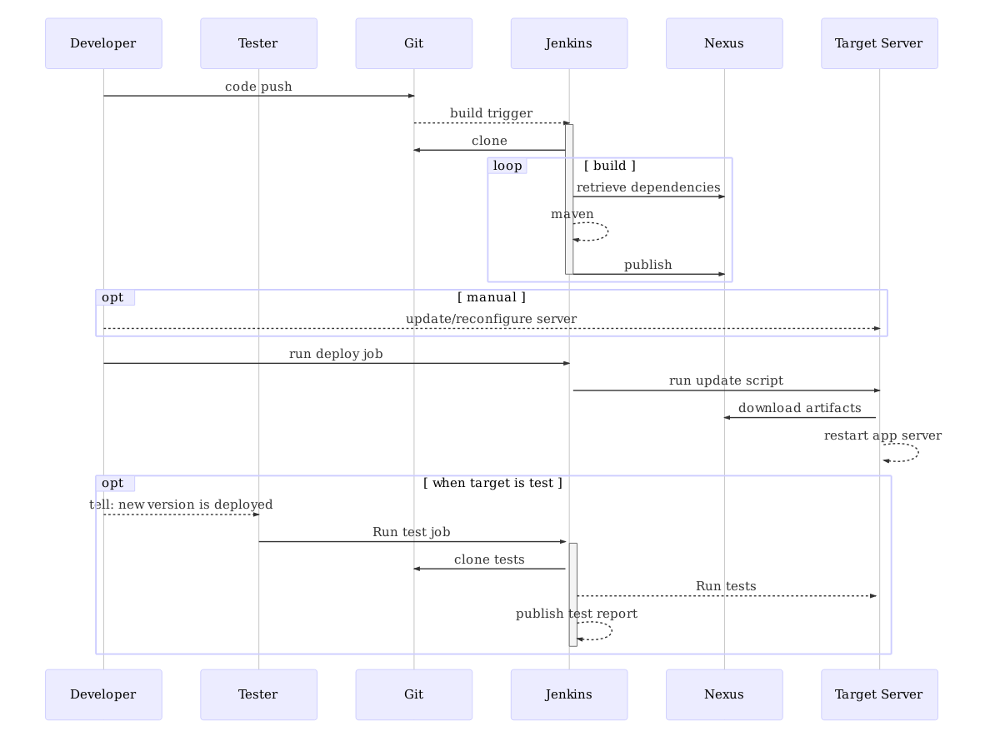

# Stages of Continuous Delivery

In this chapter I describe the different stages of continuous delivery that the
development organization went through.

## Stage 1: CI in a shared environment

Systems:

 - Subversion
 - Jenkins
 - Nexus
 - Sonar
 - Selenium
 - Deployment server

Tools

 - Maven
 - Java
 - Custom quality reporting

## Stage 2: Automated CD in a distributed environment

Systems:

  - Gitlab
  - Jenkins
  - Nexus
  - Sonar
  - Selenium
  - Deployment server

 Tools

  - Maven
  - Docker
  - Custom quality reporting

## Stage 3: --- next evolution..

## Initial situation

**! This needs to be placed elsewhere and rewritten !**

Figure \ref{basic_ci} shows the steps and interactions a developer has with
build systems in order to deploy a change in the software to a target server.

Figure \ref{basic_ci_setup} shows the steps a developer needs to take in order
to setup a single source repository and configure the continuous integration
pipeline.

