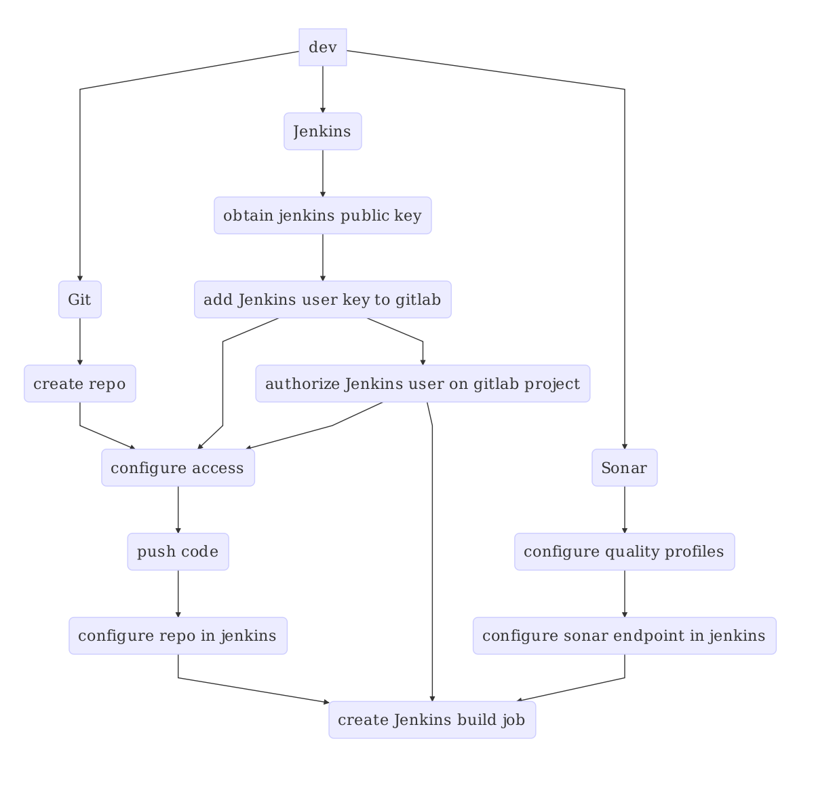

# Stages of Continuous Delivery

In this chapter I describe the different stages of continuous delivery that the
development organization went through.

## Stage 1: CI in a shared environment

**Characteristics**

- Shared between teams
- Maintenance by system administrators
- Manual maintenance
- Static deployment servers

**Systems**

- Subversion
- Jenkins
- Nexus
- Sonar
- Selenium
- Deployment server

**Tools**

- Maven
- Java
- Custom quality reporting

**Setup**

- Setup is done by system administrators

**Manual steps**

- Create build jobs, (once for every unit of development)
- Configure quality reports, (once for every unit of development)
- Manually maintain configuration of deployment server, (every time server configuration changes)
- Tester requests deployment of new version (direct communication)
- Trigger deployment job, (every time a tester requests a new version)
- Trigger automated tests
- *this list is incomplete*

 **Problems**

- Limited resources per team
- Doesn't scale beyond N teams
- Changes/upgrades affect all teams
- Teams can't install plugins or make changes to the setup
- Teams can interfere with each other causing difficult to debug and random failures
- Teams request changes to the infrastructure from the system administrators
 - Might take considerable amount of time
 - Request can be denied
- Changes to deployment server are not repeatable
- Difficult to go back N versions of the application and server configuration

## Stage 2: Automated CD in a distributed environment

**Systems**

  - Gitlab
  - Jenkins
  - Nexus
  - Sonar
  - Selenium
  - Deployment server

 **Tools**
 
  - Maven
  - Docker
  - Custom quality reporting

## Stage 3: --- next evolution..

tbd..

## Initial situation

**! This needs to be placed elsewhere and rewritten !**

Figure \ref{basic_ci} shows the steps and interactions a developer has with
build systems in order to deploy a change in the software to a target server.

Figure \ref{basic_ci_setup} shows the steps a developer needs to take in order
to setup a single source repository and configure the continuous integration
pipeline.

