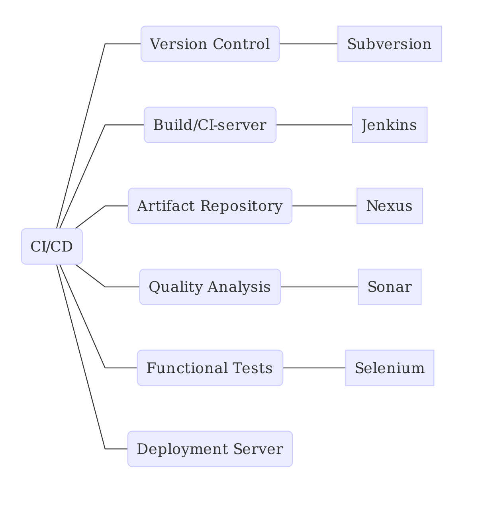

<!-- Wat is code
hoe organiseren we het nu
laat afhankelijkheden zien tussen applicaties
kan je laten zien hoeveel kennis er eigenlijk nodig is om dit voor mekaar te krijgen
waarom is het zo.

basic ci setup -> laat zien waar problemen zitten.

specificatie template meta. wat moeten we vastleggen.
van elk van de items een voorbeeld uitwerken. -->

# Stages of Continuous Delivery

In this chapter I describe the different stages of continuous delivery that the
development organization went through.

Right     Left     Center     Default
-------     ------ ----------   -------
   12     12        12            12
  123     123       123          123
    1     1          1             1

Table:  Demonstration of simple table syntax.

## Stage 1: CI in a shared environment

**Characteristics**

| . |   |
|---|---|
| CI/CD Environment | Shared               |
| Maintenance       | System Administrator |
| Deployment        | Manual               |
| Flexibility       | Static               |

<!-- - Shared between teams
- Maintenance by system administrators
- Manual maintenance
- Static deployment servers -->

**Systems**

| Server            | Type                 | Depends on             |
|-------------------|----------------------|------------------------|
| Subversion        | Version Control      |                        |
| Jenkins           | Build Server, CI     | Nexus, Sonar, Selenium |
| Nexus             | Artifact Repository  |                        |
| Sonar             | Static Code Analysis |                        |
| Selenium          |                      | Deployment Server      |
| Deployment Server |                      | Nexus                  |

<!-- - Subversion
- Jenkins
- Nexus
- Sonar
- Selenium
- Deployment server -->

**Tools**

| Tool                     | Type               | Used by       | Depends on       |
|--------------------------|--------------------|---------------|------------------|
| Maven                    | Build              | Dev, Jenkins  |                  |
| Java                     | Language, platform | Dev, Jenkins  |                  |
| Custom quality reporting | Reporting          | Jenkins       | Sonar, Selenium  |

<!--
- Maven
- Java
- Custom quality reporting
- *this list is incomplete* -->

**Setup**

- Setup is done by system administrators

**Manual steps**

| Task                              | Depends on                            | Occurrence                    |
|-----------------------------------|---------------------------------------|-------------------------------|
| Create build job                  | Jenkins                               | every new unit of development |
| Create deployment job             | Jenkins                               | every new unit of development |
| Configure quality report          | Jenkins, Quality reporting            | every new unit of development |
| Maintain server configuration     | Deployment Server                     | on configuration change       |
| Trigger deployment                | Deployment Server, Jenkins            | on request of tester or stakeholder |
| Trigger automated tests           | Deployment Server, Jenkins, Selenium  | every iteration               |

<!--
- Create build jobs, (once for every unit of development)
- Configure quality reports, (once for every unit of development)
- Manually maintain configuration of deployment server, (every time server configuration changes)
- Tester requests deployment of new version (direct communication)
- Trigger deployment job, (every time a tester requests a new version)
- Trigger automated tests
- *this list is incomplete* -->

 **Problems**

| Description                                           | Has negative impact on
|-------------------------------------------------------|----------------
| Resource sharing between all teams                    | Scalability
| Changes and upgrades affect all teams                 | Stability
| Teams can't change setup or install plugins           | Flexibility, Usability
| Teams can interfere with each other                   | Stability
| Teams depend on sysadmins                             | Agility
| Deployment server changes are difficult to reverse    | Flexibility, Scalability
| Unable to deploy multiple instances of an application | Agility, Usability

<!--

- Limited resources per team
- Doesn't scale beyond N teams
- Changes/upgrades affect all teams
- Teams can't install plugins or make changes to the setup
- Teams can interfere with each other causing difficult to debug and random failures
- Teams request changes to the infrastructure from the system administrators
 - Might take considerable amount of time
 - Request can be denied
- Changes to deployment server are not repeatable
- Difficult to go back N versions of the application and server configuration -->

## Stage 2: Automated CD in a distributed environment

**Characteristics**

| . |   |
|---|---|
| CI/CD Environment | Per team  |
| Maintenance       | Team      |
| Deployment        | Automatic |
| Flexibility       | On-demand |

- Each team has his own CI/CD environment
- The team is responsible for the environment (DevOps)
- Dynamic deployment cluster
- Application deployment is scripted
- System administrators maintain the deployment cluster
- Teams decide what their CI/CD landscape looks like

**Systems**

- Gitlab
- Jenkins
- Nexus
- Sonar
- Selenium
- Deployment server

 **Tools**

- Maven
- Docker
- Custom quality reporting

**Manual steps**

- s1

**Problems**

- p1

## Stage 3: --- next evolution..

tbd..

## Initial situation

**! This needs to be placed elsewhere and rewritten !**

Figure \ref{basic_ci} shows the steps and interactions a developer has with
build systems in order to deploy a change in the software to a target server.

Figure \ref{basic_ci_setup} shows the steps a developer needs to take in order
to setup a single source repository and configure the continuous integration
pipeline.

